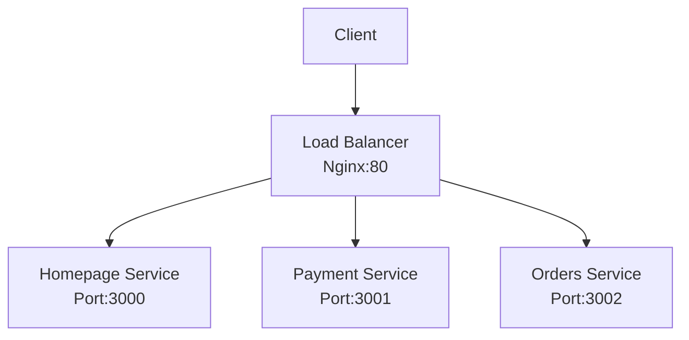

# Kubernetes Microservices Demo

This project demonstrates a simple microservices architecture deployed on Kubernetes. It showcases how to containerize multiple services and orchestrate them using Kubernetes, with Nginx acting as a reverse proxy and load balancer.

## Architecture Overview



## Services

### 1. Homepage Service

- **Port**: 3000
- **Purpose**: Serves the main landing page
- **Access**: Root path `/`
- **Technology**: Node.js, Express, EJS

### 2. Payment Service

- **Port**: 3001
- **Purpose**: Handles payment-related functionality
- **Access**: `/payment`
- **Technology**: Node.js, Express, EJS

### 3. Orders Service

- **Port**: 3002
- **Purpose**: Manages order processing
- **Access**: `/orders`
- **Technology**: Node.js, Express, EJS

### 4. Nginx Load Balancer

- **Port**: 80
- **Purpose**:
  - Acts as reverse proxy
  - Routes requests to appropriate services
  - Load balancing
- **Configuration**: Custom nginx.conf for service routing

## Kubernetes Resources

Each service is deployed with:

- Deployment (manages pods)
- Service (internal networking)
- Resource limits:
  - Memory: 64Mi
  - CPU: 250m

### Service URLs

- Homepage: `http://<load-balancer-ip>/`
- Payment: `http://<load-balancer-ip>/payment`
- Orders: `http://<load-balancer-ip>/orders`

## Project Structure

```
k8s-learn2/
├── homepage/          # Homepage service
├── payment/          # Payment service
├── orders/           # Orders service
└── nginx/            # Nginx configuration
```

## Learning Objectives

- Kubernetes deployment configuration
- Microservices architecture
- Container orchestration
- Service discovery
- Load balancing
- Reverse proxy setup
- Resource management in Kubernetes
