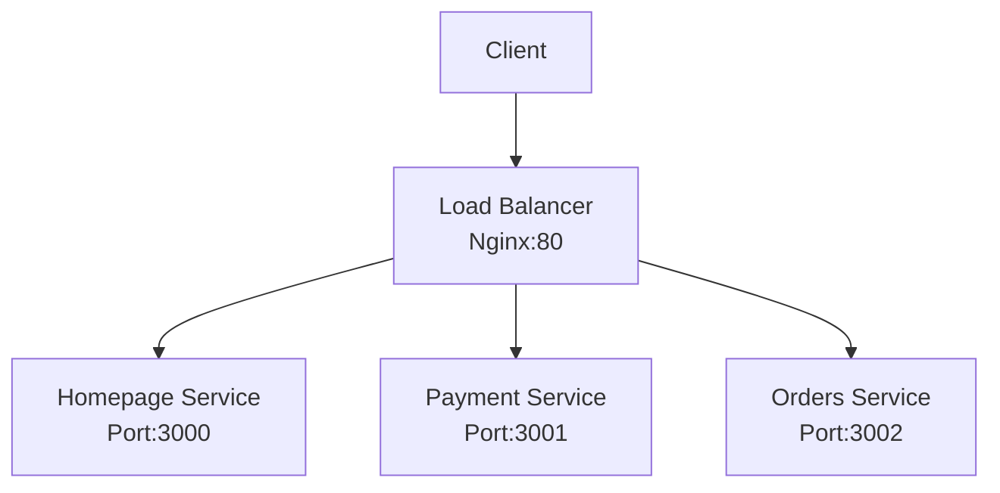

# Kubernetes Microservices Demo

This project demonstrates a simple microservices architecture deployed on Kubernetes. It showcases how to containerize multiple services and orchestrate them using Kubernetes, with Nginx acting as a reverse proxy and load balancer.

## Architecture Overview



## Services

### 1. Homepage Service

- **Access**: Root path `/`
- **Purpose**: Serves the main landing page
- **Port**: 3000

### 2. Payment Service

- **Access**: `/payment`
- **Purpose**: Handles payment-related functionality
- **Port**: 3001

### 3. Orders Service

- **Access**: `/orders`
- **Purpose**: Manages order processing
- **Port**: 3002

### 4. Nginx Load Balancer

- **Port**: 80
- **Purpose**:
  - Acts as reverse proxy
  - Routes requests to appropriate services
  - Load balancing

## CI/CD Pipeline

The project uses GitHub Actions for continuous integration and deployment:

### GitHub Actions Setup

- **Runner**: Self-hosted GitHub Runner on WSL2
- **Trigger**: On push to main branch
- **Workflow**: `.github/workflows/cicd.yaml`

### Build Process

1. Builds Docker images for all services
2. Pushes images to Docker Hub
3. Deploys to local Minikube cluster
4. Performs rolling updates without downtime

### Security

- Uses GitHub repository secrets:
  - `DOCKER_USERNAME`: Docker Hub username
  - `DOCKER_PASSWORD`: Docker Hub Personal Access Token (PAT)
- Images are tagged with `latest` and cached for faster builds

## Kubernetes Resources

Each service is deployed with:

- Deployment (manages pods)
- Service (internal networking)
- Resource limits:
  - Memory: 64Mi
  - CPU: 250m

### Service URLs

- Homepage: `http://<load-balancer-ip>/`
- Payment: `http://<load-balancer-ip>/payment`
- Orders: `http://<load-balancer-ip>/orders`

## Project Structure

```
k8s-learn2/
├── homepage/          # Homepage service
├── payment/          # Payment service
├── orders/           # Orders service
├── nginx/            # Nginx configuration
└── .github/
    └── workflows/    # GitHub Actions workflows
```

## Local Development Setup

1. **Prerequisites**:

   - WSL2 with Ubuntu
   - Docker
   - Minikube
   - kubectl
   - GitHub Runner

2. **GitHub Runner Setup**:

   ```bash
   # Install GitHub Runner
   mkdir actions-runner && cd actions-runner
   curl -o actions-runner-linux-x64-2.309.0.tar.gz -L https://github.com/actions/runner/releases/download/v2.309.0/actions-runner-linux-x64-2.309.0.tar.gz
   tar xzf ./actions-runner-linux-x64-2.309.0.tar.gz

   # Configure runner
   ./config.sh --url https://github.com/your-repo --token your-token --labels self-hosted,linux

   # Start runner
   ./run.sh
   ```

3. **Repository Secrets**:
   - Add `DOCKER_USERNAME` and `DOCKER_PASSWORD` in GitHub repository settings
   - Use Docker Hub PAT as password for better security

## Deployment Process

1. Push changes to main branch
2. GitHub Actions triggers build
3. New images are built and pushed to Docker Hub
4. Kubernetes performs rolling update
5. Services are updated without downtime
